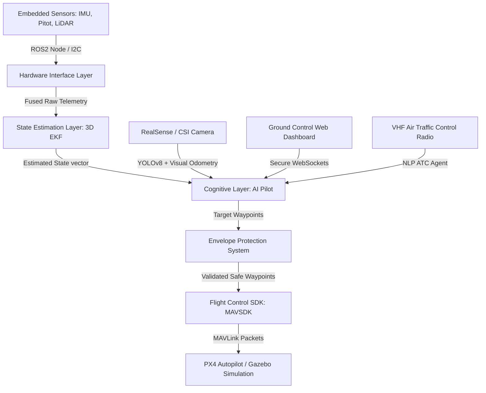

# Aegis Flight OS — Developer Architecture & Mathematical Formulations
This document details the software architecture, mathematical models, sensor fusion, and AI planning systems driving the Aegis Autonomous AI Flight Operating System.

---

## 1. System Topology & Decoupled Architecture

Aegis decouples low-level flight control (stabilization, motor control) from high-level cognitive decision making:



---

## 2. State Estimation & Sensor Fusion (3D EKF)

Aegis implements an **Extended Kalman Filter (EKF)** to merge high-frequency IMU acceleration data with low-frequency GPS positions. Altitude data from the LiDAR and barometric sensors is fused dynamically.

### State Space Representation
The system state vector $x \in \mathbb{R}^6$ represents position and velocity in three dimensions:
$$x = \begin{bmatrix} p_{lat} & p_{lon} & p_{alt} & v_{lat} & v_{lon} & v_{alt} \end{bmatrix}^T$$

### Kinematic Motion Model
The process model predictive step updates state based on time step $\Delta t$ and accelerometer inputs $u = \begin{bmatrix} a_{lat} & a_{lon} & a_{alt} \end{bmatrix}^T$:
$$x_k = F x_{k-1} + B u_k$$

Where the state transition matrix $F$ and control input matrix $B$ are formulated as:
$$F = \begin{bmatrix} 
1 & 0 & 0 & \Delta t & 0 & 0 \\ 
0 & 1 & 0 & 0 & \Delta t & 0 \\ 
0 & 0 & 1 & 0 & 0 & \Delta t \\ 
0 & 0 & 0 & 1 & 0 & 0 \\ 
0 & 0 & 0 & 0 & 1 & 0 \\ 
0 & 0 & 0 & 0 & 0 & 1 
\end{bmatrix}, \quad
B = \begin{bmatrix} 
\frac{1}{2}\Delta t^2 & 0 & 0 \\ 
0 & \frac{1}{2}\Delta t^2 & 0 \\ 
0 & 0 & \frac{1}{2}\Delta t^2 \\ 
\Delta t & 0 & 0 \\ 
0 & \Delta t & 0 \\ 
0 & 0 & \Delta t 
\end{bmatrix}$$

### Covariance Prediction
$$P_k = F P_{k-1} F^T + Q$$
Where $P$ is the state error covariance matrix and $Q$ is the process noise covariance matrix representing model uncertainty.

### Measurement Update Step
When a GPS update arrives, the measurement vector $z = \begin{bmatrix} z_{lat} & z_{lon} & z_{alt} \end{bmatrix}^T$ is processed:
$$y_k = z_k - H x_k$$
$$S_k = H P_k H^T + R$$
$$K_k = P_k H^T S_k^{-1}$$
$$x_k = x_k + K_k y_k$$
$$P_k = (I - K_k H) P_k$$

Where the measurement mapping matrix $H$ maps the state vector to output coordinates:
$$H = \begin{bmatrix} 
1 & 0 & 0 & 0 & 0 & 0 \\ 
0 & 1 & 0 & 0 & 0 & 0 \\ 
0 & 0 & 1 & 0 & 0 & 0 
\end{bmatrix}$$
And $R$ is the measurement covariance matrix representing GPS sensor noise.

---

## 3. Triple-Redundant Consensus Voting

To prevent sensor anomalies, radiation-induced bit-flips, or perception hallucinatory errors from commanding critical operations, Aegis implements a **Triple-Modular Redundant (TMR)** voting system.

```
          +--------------+
          | Evasion Node1|----\
          +--------------+     \
          +--------------+      +-------------------+      +------------------+
          | Evasion Node2|------| Consensus Voter   |----->| Safe Waypoint    |
          +--------------+      +-------------------+      +------------------+
          +--------------+     / (Checks tolerance)
          | Evasion Node3|----/
          +--------------+
```

### Consensus Mathematics
Given three proposed 3D coordinates $W_1, W_2, W_3 \in \mathbb{R}^3$, where $W_i = (\text{lat}_i, \text{lon}_i, \text{alt}_i)$:
1. Calculate horizontal Haversine distances $d_{ij} = \text{Haversine}(W_i, W_j)$ between all pairs:
   $$\text{Haversine}(W_i, W_j) = 2R \arcsin \left( \sqrt{ \sin^2\left(\frac{\Delta \phi}{2}\right) + \cos(\phi_i)\cos(\phi_j)\sin^2\left(\frac{\Delta \lambda}{2}\right) } \right)$$
2. Calculate vertical differences $h_{ij} = |\text{alt}_i - \text{alt}_j|$ between all pairs.
3. Node agreement requires:
   $$\text{Agree}(i, j) \iff \left( d_{ij} \le \tau_{\text{horizontal}} \right) \land \left( h_{ij} \le \tau_{\text{vertical}} \right)$$
   *Default values: $\tau_{\text{horizontal}} = 2.0\text{m}$, $\tau_{\text{vertical}} = 10.0\text{m}$.*

### Voting Outcomes
* **Perfect Consensus**: If all nodes agree ($\text{Agree}(1,2) \land \text{Agree}(2,3) \land \text{Agree}(1,3)$), the voter returns the average coordinate vector:
  $$W_{\text{final}} = \frac{W_1 + W_2 + W_3}{3}$$
* **Majority Consensus**: If node 3 experiences a transient error but 1 and 2 agree:
  $$W_{\text{final}} = \frac{W_1 + W_2}{2}$$
* **System Collapse**: If no two nodes agree, the voter raises a safety exception, instantly disarms motors, and deploys emergency backup hardware.

---

## 4. Cognitive Path Planning (DQN)

The AI Pilot uses a **Deep Q-Network (DQN)** for reinforcement learning path planning, finding optimal trajectories through 3D obstacle fields.

### State Normalization Vector
The raw telemetry is compressed into a 5-dimensional normalized vector $s \in [-1, 1]^5$:
$$s = \begin{bmatrix} \bar{d}_x & \bar{d}_y & \bar{\theta} & \bar{o} & c \end{bmatrix}$$
Where:
- $\bar{d}_x, \bar{d}_y$: Horizontal distance to target, clamped to $[-1, 1]$ relative to a $0.005^{\circ}$ bounding box:
  $$\bar{d}_x = \max\left(-1.0, \min\left(1.0, \frac{\text{target\_lon} - \text{drone\_lon}}{0.005}\right)\right)$$
- $\bar{\theta}$: Heading offset relative to target:
  $$\bar{\theta} = \frac{\arctan2(d_y, d_x)}{\pi}$$
- $\bar{o}$: Obstacle proximity calculated using inverse LiDAR/vision distance:
  $$\bar{o} = \max\left(0.0, \min\left(1.0, \frac{1}{\text{dist}_{\text{obs}} + 0.1}\right)\right)$$
- $c$: Reserved channels (e.g., target speed or remaining fuel).

### Action Space Mapping
The DQN outputs $Q(s, a)$ values for 5 discrete maneuvers:
$$\mathcal{A} = \{ \text{MAINTAIN\_HEADING}, \text{VEER\_LEFT}, \text{VEER\_RIGHT}, \text{CLIMB}, \text{DESCEND} \}$$

---

## 5. Security & SWARM Authentication

SWARM network packets communicate obstacle and position updates over local interfaces. To prevent signal injection or node spoofing, packets are cryptographically signed using **HMAC-SHA256**:

```
+-------------------------------------------------------------+
| JSON Telemetry Data:                                        |
| { "drone_id": 1, "lat": 47.39, "lon": 8.54, "alt": 10.0 }   |
+-------------------------------------------------------------+
                              |
                              v
                      [HMAC-SHA256] <--- Secret Key (AEGIS_FLEET_SECRET)
                              |
                              v
+-------------------------------------------------------------+
| Signed SWARM Network Packet:                                |
| data: <base64_encoded_json>                                 |
| signature: f8a3b8c2e9a...                                   |
+-------------------------------------------------------------+
```

Before processing any incoming swarm update, receivers calculate:
$$\text{Expected Signature} = \text{HMAC-SHA256}(\text{Packet Payload}, K_{\text{fleet}})$$
If the signatures mismatch, the package is immediately discarded and an alert is broadcast to the GCS.
